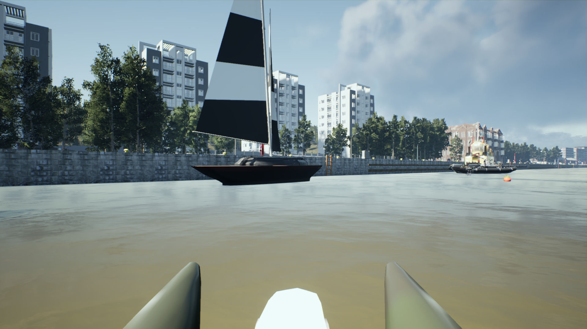

# Detailed Report: Generated vs. Real Images Classification

## Table of Contents
1. [Introduction](#1-introduction)
2. [Dataset Collection and Preprocessing](#2-dataset-collection-and-preprocessing)
   - [2.1 Datasets Used](#21-datasets-used)
   - [2.2 Justification for Dataset Selection](#22-justification-for-dataset-selection)
   - [2.3 Preprocessing Steps](#23-preprocessing-steps)
   - [2.4 Dataset Splitting Strategy](#24-dataset-splitting-strategy)
   - [2.5 Augmentation and Preprocessing](#25-augmentation-and-preprocessing)
3. [Model Choice and Architecture](#3-model-choice-and-architecture)
   - [3.1 Selected Model: MobileNetV3 Small](#31-selected-model-mobilenetv3-small)
   - [3.2 Model Customization and Implementation](#32-model-customization-and-implementation)
4. [Training and Hyperparameters](#4-training-and-hyperparameters)
   - [4.1 Training Configuration](#41-training-configuration)
   - [4.2 Hardware Utilization](#42-hardware-utilization)
   - [4.3 Evaluation Metrics](#43-evaluation-metrics)
   - [4.4 Experimental Stability](#44-experimental-stability)
5. [Visualizations](#5-visualizations)
   - [5.1 Loss Metrics Analysis](#51-loss-metrics-analysis)
   - [5.2 Validation Metrics Analysis](#52-validation-metrics-analysis)
   - [5.3 Training Metrics Analysis](#53-training-metrics-analysis)
   - [5.4 Comparative Analysis: Training vs Validation Metrics](#54-comparative-analysis-training-vs-validation-metrics)
6. [Evaluation Results (Test)](#6-evaluation-results-test)
   - [6.1 Metrics](#61-metrics)
   - [6.2 Confusion Matrix](#62-confusion-matrix)
   - [6.3 Insights](#63-insights)
7. [Discussion](#7-discussion)
   - [7.1 Key Findings](#71-key-findings)
   - [7.2 Limitations](#72-limitations)
   - [7.3 Future Improvements](#73-future-improvements)
8. [Conclusion](#8-conclusion)
9. [References](#9-references)

---

## 1. Introduction
This report analyzes a computer vision classifier for distinguishing generated maritime images from real-world ones, covering datasets, preprocessing, model architecture, evaluation metrics, and results.

## 2. Dataset Collection and Preprocessing
### 2.1 Datasets Used
The project utilizes one synthetic dataset and three real-world datasets for training and evaluation:

1. **SimuShips Dataset**  
   - Contains 9,471 high-resolution (1920x1080) synthetic maritime images with detailed annotations.
   - Available on [Zenodo](https://zenodo.org/records/7003924).  
   - Refer to the associated publication for more details: [ArXiv](https://arxiv.org/abs/2211.05237).
   - Examples:
    

    
    
    

2. **ABOships Dataset**  
   - Contains 9,880 real-world maritime images extracted from videos (720p, 15 FPS) acquired in the Finnish Archipelago, annotated with 41,967 objects across 11 categories.  
   - Available on [Zenodo](https://zenodo.org/records/4736931).  
   - Refer to the associated paper: [MDPI Remote Sensing](https://www.mdpi.com/2072-4292/13/5/988).
   - Examples:
    

    
    
    
   

3. **Singapore Maritime Dataset**  
   - Contains 81 videos (1920x1080, 30 FPS) collected from Singapore waters. Includes three subsets:  
     - Visible On-Shore (40 videos, 3 GB)   
     - Visible On-Board (11 videos, 768 MB)
     - Near-Infrared On-Shore (30 videos, 1.51 GB)
   - Dataset details and downloads are available [here](https://sites.google.com/site/dilipprasad/home/singapore-maritime-dataset).
   - Refer to the associated publication for more details: [ArXiv](https://arxiv.org/abs/1611.05842).
   - Examples:

    **Visible On-Shore**
    

        
        
    

    

    **Visible On-Board**
    

        
        
    

    

    **Near-Infrared On-Shore**
    

        
        
    

### 2.2 Justification for Dataset Selection

1. **Singapore Maritime Dataset**  
   - The Singapore Maritime Dataset presents a domain shift compared to the SimuShips Dataset, making it a good choice for testing generalization. However, its highly distinct appearance (open seas, tropical conditions) caused severe overfitting during initial experiments when paired only with SimuShips.  
   - Key limitations include:  
     - Videos are short (10–30 seconds) and recorded at 30 FPS, resulting in limited frame diversity.  
     - Frames extracted from adjacent timestamps are often visually redundant, limiting the dataset's ability to prevent overfitting.

2. **ABOships Dataset**  
   - The ABOships Dataset shares visual and environmental similarities with SimuShips, adding complexity and pushing the model to focus on nuanced features over dataset-specific artifacts.  
   - Its frame extraction strategy (one image every 15 seconds at 15 FPS) results in a more diverse dataset compared to Singapore, which contributes positively to training stability and generalization.  
   - Initial experiments using SimuShips with ABOships showed slower and less severe overfitting compared to SimuShips + Singapore, emphasizing the need to balance dataset diversity and domain similarity.

3. **Combining Singapore and ABOships Datasets**  
   - To address overfitting while maintaining task complexity, the ABOships and Singapore datasets were combined:  
     - ABOships serves as the primary real-world dataset, leveraging its diversity and alignment with SimuShips.  
     - The Singapore dataset introduces a controlled domain shift, forcing the model to learn features invariant to environmental differences (e.g., tropical vs. Nordic conditions).  
   - This combination acts as implicit regularization, helping the model generalize across maritime domains without overfitting to the contrast between SimuShips and Singapore.

4. **Technical Considerations and Dataset Trade-offs**  
   - The visual overlap between SimuShips and ABOships ensures that the task remains sufficiently challenging, as the model cannot exploit trivial differences to distinguish between generated and real images.  
   - The inclusion of Singapore mitigates the risk of the model overfitting to narrow real-world conditions (e.g., Finnish waters), thereby improving its robustness across unseen environments.  

### **Conclusion**  
This dataset selection strategy aligns with principles of domain generalization and model robustness. By incorporating both domain similarity (ABOships) and diversity (Singapore), the model is better equipped to generalize to varied real-world scenarios while minimizing overfitting.

### **2.3 Preprocessing Steps**

#### **SimuShips Dataset**  
- The dataset contains 9,471 high-resolution images, but a portion of these images exhibits significant similarity (e.g., slight variations in position or perspective).  
- **Current Approach:** No cleaning was performed as the dataset is synthetically generated and uniformly annotated.  
- **Future Work:** Techniques such as perceptual hashing (`imagehash`), feature-based clustering (e.g., embeddings from ResNet or CLIP), and structural similarity metrics (e.g., SSIM) could be explored in the future to filter near-duplicate images. This would enhance data diversity and ensure the training set consists of more meaningful and varied examples.

#### **ABOships Dataset**  
- The dataset contains 9,880 frames extracted sparsely (one frame every 15 seconds). Despite the low extraction frequency, many frames are visually similar due to minimal camera dynamics.  
- **Initial Experiments:** Using the full dataset without filtering during the initial experiments led to faster overfitting and poorer generalization.  
- **Preprocessing:** Retained every 3rd frame during preprocessing, significantly improving training performance by reducing redundancy and mitigating overfitting.  
- **Effectiveness:** The cleaned subset showed better generalization and slower overfitting compared to using all frames.

#### **Singapore Maritime Dataset**  
- The dataset consists of three subsets, with preprocessing customized to its specific characteristics:  
  - **Visible On-Shore & Near-Infrared (NIR):**  
    - Recorded with fixed cameras in relatively **static** environments.  
    - Extracted every 30th frame to minimize redundancy and emphasize meaningful changes across frames.  
  - **Visible On-Board:**  
    - Recorded from a **moving** vessel, resulting in higher frame-to-frame variation.  
    - Extracted every 10th frame to preserve more dynamics while avoiding overly repetitive samples.  
- **Rationale for Frame Selection:** Customizing frame extraction frequency to each subset’s characteristics ensures data diversity while minimizing redundancy, capturing relevant variations without overwhelming the model with repetitive samples.

### **2.4 Dataset Splitting Strategy**

To prevent **data leakage** and overly optimistic validation scores, a tailored splitting strategy was applied to both synthetic and real datasets.

#### **SimuShips Dataset**

- **Structure:** The SimuShips dataset contains 9,471 high-resolution synthetic images organized in a sequential order, with conditions such as lighting, weather, and object types gradually changing.
- **Challenge:** Random splitting would risk data leakage, as sequentially similar images could appear in both training and validation/test sets, compromising evaluation reliability.
- **Approach:** Sequential split was applied to ensure that similar images are confined to a single split:
  - The first 7,500 images were allocated to the **training set**.
  - The next 1,000 images were assigned to **validation**.
  - The remaining 971 images were reserved for **testing**.
  - These limits (e.g., `train_split_limit`: 7,500, `val_split_limit`: 8,500) are configurable in the `config.yaml` file under `gen_split` and can be adjusted based on project-specific needs.

- **Technical Considerations:**
  - Sequential splitting eliminates trivial patterns caused by similar or sequential images in the training and validation/testing sets.
  - This ensures the evaluation reflects the model’s performance on unseen, distinct conditions, making it more reliable.

#### **Real Datasets (ABOships & Singapore)**

- **Structure:** Each real dataset (ABOships and the three Singapore subsets) contains frames extracted from videos, organized into folders. Each folder corresponds to frames extracted from a single video.
- **Challenge:** Randomly splitting frames could lead to data leakage, where similar frames from the same video appear in both training and validation/testing sets, resulting in misleadingly high validation performance.
- **Approach:**
  - **Folder-Level Splitting:**
    - 80% of folders in each dataset were used for **training**.
    - The remaining 20% of folders were equally divided between **validation** and **testing**.
  - After splitting, the train, validation, and test subsets from ABOships and Singapore datasets were **combined separately** to form the full real-world training, validation, and test datasets.
- **Technical Considerations:**
  - Splitting at the folder level preserves the temporal and contextual integrity of frames within a video, avoiding redundancy across splits.
  - Combining the splits after division ensures a balanced representation of both datasets in the final training, validation, and testing sets.
  - Splitting each dataset before combining prevents uneven contributions from smaller subsets, such as Singapore’s Visible On-Board dataset.

#### **Conclusion**

This splitting strategy prevents data leakage, ensuring robust and unbiased model evaluation. It balances dataset diversity (Singapore) with domain similarity (ABOships), while preserving the contextual integrity of sequential and video-based data. The result is a clean and reliable division into training, validation, and testing sets that reflects real-world performance and generalization capabilities.

### **2.5 Augmentation and Preprocessing**

#### **Preprocessing Steps**
To align the data with the model's input requirements and enhance its generalization capabilities the following preprocessing pipeline:

1. **Resizing:**
   - All images were resized to a uniform resolution of **224x224 pixels** (as defined in the `config.yaml` file under `data_config`) to ensure compatibility with the input layer of the `mobilenetv3_small_100` model.
   - This standardization reduces the computational load during training and ensures consistency across datasets.

2. **Normalization:**
   - Pixel values were normalized to have zero mean and unit variance.
   - This step mitigates the effects of varying lighting conditions and enhances the convergence stability of the model.

3. **Tensor Conversion:**
   - Images were converted into PyTorch-compatible tensors to prepare them for training and evaluation.

The `height` and `width` values for resizing, as well as other preprocessing parameters, can be adjusted in the `config.yaml` file to suit different model architectures or experimental setups.

#### **Data Augmentation**
To enhance generalization and reduce overfitting, augmentation techniques from the Albumentations library were applied probabilistically, adding diversity to the training data. The augmentation parameters, including probabilities and intensity limits, are defined in the `config.yaml` file under `augmentation_params` and can be adjusted as needed for different experimental setups.

1. **Geometric Transformations:**
   - **Horizontal Flip & Vertical Flip:** Randomly applied to capture invariance to orientation.
   - **Random Rotate 90 & Transpose:** Enhance robustness to varying perspectives.
   - **Shift-Scale-Rotate:** Applied with controlled limits for translations, scaling, and rotations (examples of augmented images are shown).
    

        
        
    

2. **Color Augmentations:**
   - **Hue-Saturation-Value Adjustment:** Variations in hue, saturation, and brightness to simulate different lighting conditions.
   - **Random Brightness & Contrast Adjustment:** Introduced diversity in exposure and contrast (examples of before/after augmentation images are shown).
    

        
        
    

3. **Blurring and Noise:**
   - **Gaussian Noise:** Introduced pixel-level noise to mimic sensor inaccuracies.
   - **Gaussian Blur & Motion Blur:** Added to simulate motion artifacts and focus imperfections (examples of before/after augmentation images are shown).
    

        
        
    

4. **Elastic and Grid Distortions:**
   - **Grid Distortion:** Warped grid patterns to simulate optical aberrations.
   - **Elastic Transform:** Simulated local distortions, such as water ripple effects (examples of before/after augmentation images are shown).
    

        
        
    

5. **Spatial Dropout:**
   - **Coarse Dropout:** Randomly masked image regions to train the model to capture broader spatial features instead of focusing on local patches (examples of augmented images are shown).
    

        
        
    

6. **Gamma Correction:**
   - **Random Gamma Adjustment:** Simulated variations in camera exposure.

## 3. Model Choice and Architecture

### 3.1 Selected Model: MobileNetV3 Small
- **Architecture:** MobileNetV3 Small (`mobilenetv3_small_100`) from the [timm](https://github.com/huggingface/pytorch-image-models) library ([code](https://github.com/huggingface/pytorch-image-models/blob/main/timm/models/mobilenetv3.py)).
- **Corresponding Publication:** This model is based on the architecture introduced in the paper "[Searching for MobileNetV3](https://arxiv.org/abs/1905.02244)" by Andrew Howard et al.
- **Key Advantages:**
  - **Efficiency:** Lightweight design optimized for resource-limited edge devices, enabling fast real-time maritime image analysis onboard vessels or in edge monitoring systems without cloud dependency.
  - **Overfitting Mitigation:** Outperformed larger models like ResNet and EfficientNet by addressing overfitting observed in initial experiments, achieving a better balance between complexity and generalization.

    

### 3.2 Model Customization and Implementation
- **Customizations:**
  - Replaced the default classification layer with a binary classification output layer.
  - Added a dropout layer (`p=0.5`) to mitigate overfitting and enhance generalizability.
  - Used Binary Cross-Entropy with Logits (`BCEWithLogitsLoss`) for effective handling of the binary classification task.

- **Loss Function: Binary Cross-Entropy with Logits**
  - **Choice and Rationale:**
    - `BCEWithLogitsLoss` was chosen as it integrates sigmoid activation and binary cross-entropy computation in a numerically stable manner.
    - It avoids the common issues of instability and gradient saturation that arise from separately applying sigmoid and binary cross-entropy loss (`BCELoss`).
    - Other alternatives:
      - **BCELoss:** Requires manual sigmoid activation, increasing the risk of numerical instability for extreme logits.
      - **CrossEntropyLoss:** Designed for multi-class classification, making it less efficient for binary tasks.
      - **Focal Loss:** Useful for severe class imbalance, which is not relevant in this case.
      - **Mean Squared Error (MSE):** Treats classification as a regression task, leading to slower convergence and suboptimal performance.

- **Regularization:**
  - **L1 Regularization:** 
    - Applied explicitly to model parameters via the L1 norm (`l1_lambda = 1e-4`) as configured in the `config.yaml` file.
    - Helps control sparsity by penalizing large weights, improving generalization in edge scenarios.
  - **L2 Regularization (Weight Decay):**
    - Incorporated through the `weight_decay = 1e-5` parameter of the AdamW optimizer.
    - Helps prevent overfitting by penalizing large weights, encouraging smoother gradients and more robust convergence.

- **Implementation:**
  - Loss and regularization configurations are fully parameterized in `config.yaml` for flexibility.
  - Training is managed using PyTorch Lightning, leveraging callbacks like early stopping, checkpointing, and learning rate monitoring.

## 4. Training and Hyperparameters
The training configuration was designed to maximize the efficiency of the lightweight MobileNetV3 Small architecture, particularly for binary classification in maritime image analysis. The implementation aligns with the project's goal of deploying models on resource-constrained edge devices.

### 4.1 Training Configuration
- **Optimizer:** The model was trained using the `AdamW` optimizer, chosen for its ability to balance performance and regularization by incorporating weight decay.
- **Learning Rate Schedule:** A `CosineAnnealingLR` scheduler was used with the following configuration:
  - Initial Learning Rate (`lr`): **1e-5**
  - Minimum Learning Rate (`eta_min`): **1e-6**
  - Total Steps (`T_max`): **100 epochs**
  This approach allows the learning rate to start high, facilitating faster convergence initially, and gradually decrease to stabilize the training process.

- **Batch Size:** A batch size of **6** was chosen to manage high-resolution maritime images while balancing GPU memory use and gradient stability.

- **Early Stopping:** Training included early stopping with a patience of **20 epochs**, monitoring the validation F1 score (`val_f1`) to prevent overfitting.

### 4.2 Hardware Utilization
- **Accelerator:** Training was conducted using an NVIDIA GeForce RTX 3070 with CUDA support.

### 4.3 Evaluation Metrics
- **Primary Metric:** The model's performance was evaluated using the F1 Score (`val_f1`), ensuring a balance between precision and recall.
- **Additional Metrics:** Accuracy, precision, and recall were tracked during training and validation to assess the model's performance.

### 4.4 Experimental Stability
The entire training process was reproducible, with seeds (`seed=42` customized in `config.yaml` file) set for all random number generators. This ensured consistent results across runs.

## 5. Visualizations

### 5.1 Loss Metrics Analysis

    
    
    

#### **1. Total Loss (`train_total_loss`)**
  - The `train_total_loss` combines `train_bce_with_logits_loss` and `L1` regularization term.
  - The `train_total_loss` confirms that the training process progresses without divergence or significant plateaus, reflecting proper hyperparameter tuning.
  - The steady and consistent decline indicates successful optimization of the overall objective function.
  - The gradual flattening toward later iterations suggests convergence, where the model learns more subtle patterns.
  - The absence of irregular spikes indicates stable training without divergence.
  - The smooth decline validates that the optimizer (AdamW) and learning rate scheduler (cosine decay) are effectively configured.

#### **2. Binary Cross-Entropy with Logits Loss (`train_bce_with_logits_loss`)**
  - The `train_bce_with_logits_loss` validates the model's improving ability to distinguish between the two classes, despite batch-level noise.
  - Initial spikes reflect the model exploring the parameter space during early training.
  - The overall downward trend confirms the model's ability to improve binary classification accuracy over iterations.
  - The noise in the plot is typical of mini-batch gradient-based optimization (used by AdamW). It arises because the loss is calculated over small, randomly sampled batches rather than the entire dataset, causing natural fluctuations between iterations. This noise is not indicative of instability but rather an expected characteristic of batch-wise training.
  - The decreasing trend, even with fluctuations, highlights the model's ability to reduce classification errors.

#### **3. L1 Regularization Loss (`train_l1_loss`)**
  - The `train_l1_loss` confirms the contribution of L1 regularization in maintaining weight sparsity, indirectly supporting generalization.
  - The steady decline in this loss suggests that weight magnitudes are being effectively controlled.
  - A decreasing `train_l1_loss` demonstrates the effectiveness of L1 regularization in constraining weight growth without hindering the model's learning process.

### 5.2 Validation Metrics Analysis

    
    

    
    

#### **1. F1 Score (`val_f1`)**
  - The plot demonstrates a consistent improvement, reaching a high value close to 1.0 as training progresses.
  - Early improvements indicate the model's rapid ability to effectively classify both real and generated images.
  - The stability in later iterations suggests convergence without signs of overfitting.
  - The high F1 score confirms strong generalization to the validation dataset, which is critical for practical deployment in unseen scenarios.

#### **2. Accuracy (`val_accuracy`)**
  - The plot shows a steady rise, stabilizing near 1.0 as the training progresses.
  - The consistent upward trend and lack of significant drops indicate robust learning.
  - High accuracy across iterations reflects reliable predictions and effective differentiation between real and generated images.

#### **3. Precision (`val_precision`)**
  - The plot demonstrates rapid improvement with stabilization at a high value close to 1.0.
  - The steady precision highlights the model's ability to minimize incorrect classifications of generated images as real.
  - Consistent precision across iterations reflects confidence in the classification of generated images.
  - High precision ensures the model avoids misclassifying real images, a critical aspect in real-world applications.

#### **4. Recall (`val_recall`)**
  - The plot shows a smooth and consistent improvement, stabilizing near 1.0.
  - Initial fluctuations are expected as the model adjusts to the dataset but diminish as training stabilizes.
  - High recall ensures the model effectively identifies generated images without missing key instances.
  - The alignment of recall with precision confirms a balanced trade-off, crucial for achieving high F1 scores.

### Summary
The combined analysis of these metrics indicates:
- **Strong Generalization:** The high and stable values across all metrics confirm the model's robustness on the validation set.
- **Balanced Trade-offs:** The alignment of precision, recall, and F1 score demonstrates effective differentiation between real and generated images.
- **Convergence and Stability:** The lack of significant fluctuations or instability in any metric underscores proper training, hyperparameter tuning, and dataset preparation.

### 5.3 Training Metrics Analysis

    
    

    
    

#### **1. Accuracy (`train_accuracy`)**
  - The plot shows a steady increase, reaching values close to 1.0 as the training progresses.
  - The rapid initial rise reflects the model's ability to quickly learn patterns in the training data.
  - Stabilization near 1.0 indicates effective learning and convergence.
  - The absence of significant fluctuations demonstrates the robustness of the training process and proper optimization.

#### **2. F1 Score (`train_f1`)**
  - The consistent upward trajectory indicates improving balance in correctly classifying both real and generated images.
  - The smooth increase highlights the model's ability to adapt to the dataset while avoiding overfitting.
  - High F1 scores confirm the model’s suitability for binary classification tasks with balanced performance requirements.

#### **3. Precision (`train_precision`)**
  - The plot indicates steady improvement, converging near 1.0 as training progresses.
  - The lack of noise and smooth ascent confirm stable optimization and effective differentiation of generated images from real ones.
  - The early rise demonstrates effective learning even in the initial training stages.
  - High precision ensures the model's ability to make confident and accurate classifications of generated images.

#### **4. Recall (`train_recall`)**
  - The plot shows consistent improvement and stabilization at high values.
  - The alignment with precision and F1 indicates a balanced trade-off between correctly identifying real and generated images.
  - The smooth progression highlights convergence without signs of instability.
  - High recall validates the model’s ability to effectively detect generated images, ensuring comprehensive classification coverage.

### Summary
The combined analysis of these metrics demonstrates:
- **Efficient Learning:** Rapid initial improvements across all metrics validate the model's effective adaptation to the training dataset.
- **Stable Convergence:** The smooth and consistent trends confirm proper hyperparameter tuning and the absence of significant overfitting.
- **Balanced Performance:** The alignment of precision, recall, and F1 score reflects robust handling of class differentiation and reliable predictions for both real and generated images.

### 5.4 Comparative Analysis: Training vs Validation Metrics

#### **1. F1 Score**
  - The training and validation F1 scores show consistent improvement, stabilizing near 1.0 in later iterations.
  - The alignment between the two curves indicates that the model generalizes well to the validation dataset without significant overfitting.
  - The absence of large gaps between training and validation F1 scores reflects balanced learning across both datasets, suggesting appropriate regularization and effective hyperparameter tuning.

#### **2. Accuracy**
  - Training and validation accuracy curves follow similar trends, with both stabilizing at high values close to 1.0.
  - The slight lag in validation accuracy during early iterations is expected, as the model adapts to unseen data.
  - The close alignment of accuracy metrics indicates that the model learns meaningful patterns rather than relying on dataset-specific features.

#### **3. Precision**
  - Precision for both training and validation stabilizes at comparable high values, indicating effective differentiation between real and generated images in both datasets.
  - Minor fluctuations in validation precision during early training highlight the model's adjustment to unseen data, which diminishes as training progresses.
  - The consistent precision across datasets suggests robust decision-making, reducing misclassification of real images.

#### **4. Recall**
  - Training and validation recall curves converge closely over iterations, stabilizing near 1.0.
  - Initial fluctuations in validation recall are slightly more pronounced than in training, reflecting the model's adjustment to diverse instances of generated images in the validation set.
  - The alignment between recall metrics demonstrates balanced learning, ensuring both types of images are effectively identified.

#### **Summary**
- **Generalization:** The close alignment of training and validation metrics across all categories confirms strong generalization and minimal overfitting.
- **Model Robustness:** The stability of validation metrics highlights the model's robustness on unseen data, a key requirement for real-world deployment.
- **Balanced Trade-offs:** The synchronized trends across F1, accuracy, precision, and recall indicate a balanced optimization process, ensuring effective classification of both real and generated images.

## 6. Evaluation Results (Test)

### 6.1 Metrics
The classifier's performance on the test set indicates perfect classification, with the following metrics:
- **Accuracy:** 100%
- **Precision:** 100%
- **Recall:** 100%
- **F1-Score:** 100%

### 6.2 Confusion Matrix
- **True Negatives (TN):** 699 (41.86%) - Real images correctly classified as real.
- **False Positives (FP):** 0 (0.00%) - No real images were misclassified as simulated.
- **False Negatives (FN):** 0 (0.00%) - No simulated images were misclassified as real.
- **True Positives (TP):** 971 (58.14%) - Simulated images correctly classified as simulated.

    

### 6.3 Insights

- **High Predictive Accuracy:** The model achieved perfect scores across all metrics, demonstrating its ability to distinguish real from simulated images.

- **Dataset-Specific Generalization:** The results suggest the classifier leverages dataset-specific artifacts such as texture, lighting, and rendering styles to achieve high accuracy.

- **Task Complexity:** The ability to classify images perfectly indicates that distinguishing between the SimuShips dataset and real-world datasets may not present significant complexity due to their distinguishable visual differences.

- **Potential Overfitting:** The absence of misclassifications raises concerns that the model might rely on dataset-specific artifacts instead of generalizable features, potentially limiting its robustness to unseen datasets.

- **Future Recommendations:** These results highlight the importance of evaluating the classifier on additional datasets and improving synthetic data realism to reduce the visual gap between real and simulated images.

## 7. Discussion

### 7.1 Key Findings

- **Model Performance and Task Simplicity:** The model achieved near-perfect accuracy on training, validation, and test sets, indicating that the task of distinguishing between synthetic (SimuShips) and real-world datasets may be inherently simple due to noticeable dataset-specific differences.

- **Potential Overfitting to Dataset Artifacts:** The classifier might rely on dataset-specific artifacts rather than generalizable features. The rapid convergence and high metrics suggest that utilized evaluation metrics may overestimate the model's true generalization ability.

- **Visual Distinguishability:** Even without model inference, synthetic and real images exhibit clear differences in texture, lighting, and rendering quality. This distinct visual gap simplifies the classification task, reducing its complexity.

- **Domain Gap Between Datasets:** A significant domain gap exists between SimuShips and real-world datasets (ABOships and Singapore Maritime), such as differences in environmental conditions and image quality. This may enable the model to easily distinguish between the two, rather than learning nuanced features.

- **Limitations of Synthetic Data Realism:** The synthetic images lack photorealism, making them less effective in training models that generalize well to real-world data. This limitation highlights the need to improve the quality of synthetic datasets.

- **Need for Advanced Evaluation Techniques:** Traditional metrics like accuracy and F1 score may not fully capture the nuances of model performance. Techniques such as t-SNE visualizations and Grad-CAM can provide deeper insights into the learned features and patterns.

### 7.2 Limitations

- **Dataset Representativeness:** Real-world datasets may not adequately represent the variability found in real maritime environments, limiting the model's ability to generalize beyond the provided samples.

- **Synthetic Data Quality:** Current synthetic images lack sufficient realism, especially in aspects like lighting, texture, and environmental variability, reducing their effectiveness for robust model training.

- **Overfitting Risk:** High performance metrics may hide overfitting to dataset artifacts or noise patterns rather than meaningful features.

- **Lack of Model Interpretability Analysis:** No interpretability techniques were employed to understand which features or regions the model uses for classification, limiting insights into the model's decision-making process.

### 7.3 Future Improvements

- **Enhancing Synthetic Data Realism:** Leverage advanced generative models, such as diffusion models or GANs, to create more photorealistic synthetic images. This would help narrow the domain gap and make classification tasks more challenging and generalizable.

- **Domain Adaptation Techniques:** Incorporate strategies like adversarial training, domain alignment, or feature mapping to align synthetic and real-world data distributions, improving the model's generalization capabilities.

- **Model Interpretability Analysis:** Utilize tools like Grad-CAM or SHAP to visualize features or regions that the model relies on for classification. This helps validate that the model learns meaningful patterns.

- **Cross-Domain Validation:** Evaluate the model on additional synthetic/real datasets from varied maritime domains to test its generalization capabilities and detect potential overfitting.

- **Ensemble Methods and Larger Architectures:** Experiment with ensemble models or larger architectures with regularization techniques to capture more complex patterns without overfitting.

## 8. Conclusion

- **Summary of Findings:** The classifier demonstrated high accuracy in distinguishing synthetic and real images, highlighting the simplicity of the task due to clear dataset-specific differences.

- **Implications for Synthetic Data Utilization:** The results underline the importance of improving the realism of synthetic images to better support models intended for real-world deployment.

- **Necessity for Improved Realism:** Narrowing the gap between synthetic and real images using advanced generative techniques is critical to enhancing model robustness and generalization.

- **Business Impact and Opportunities:** Enhancing synthetic data realism can improve the performance of maritime AI systems while increasing the market value of synthetic data tools.

- **Future Work Direction:** Focus on advanced synthetic data generation, domain adaptation, and interpretability techniques to address current limitations.

## 9. References

1. **SimuShips Dataset**  
   - [Zenodo Repository](https://zenodo.org/records/7003924)  
   - Associated Publication ["SimuShips -- A High Resolution Simulation Dataset for Ship Detection with Precise Annotations"](https://arxiv.org/abs/2211.05237)

2. **ABOships Dataset**  
   - [Zenodo Repository](https://zenodo.org/records/4736931)  
   - Associated Publication: ["ABOships: A Real-World Maritime Dataset for Object Detection and Classification"](https://www.mdpi.com/2072-4292/13/5/988)

3. **Singapore Maritime Dataset**  
   - [Dataset Repository](https://sites.google.com/site/dilipprasad/home/singapore-maritime-dataset)  
   - Associated Publication: ["Video Processing from Electro-optical Sensors for Object Detection and Tracking in Maritime Environment: A Survey"](https://arxiv.org/abs/1611.05842) (*ArXiv*)

4. **PyTorch Lightning Documentation**  
   - [Official Website](https://www.pytorchlightning.ai)

5. **MobileNetV3 Architecture**  
   - [GitHub Repository](https://github.com/huggingface/pytorch-image-models)  
   - [Model Code](https://github.com/huggingface/pytorch-image-models/blob/main/timm/models/mobilenetv3.py)     
   - [Corresponding Publication](https://arxiv.org/abs/1905.02244)

6. **Albumentations Library**  
   - [Official Documentation](https://albumentations.ai)

7. **Grad-CAM Visualization Tool**  
   - Selvaraju, R. R., et al. ["Grad-CAM: Visual Explanations from Deep Networks via Gradient-Based Localization.](https://arxiv.org/abs/1610.02391)

8. **t-SNE Visualization**  
   - Maaten, L. v. d., & Hinton, G. ["Visualizing Data using t-SNE."](https://www.jmlr.org/papers/volume9/vandermaaten08a/vandermaaten08a.pdf)
